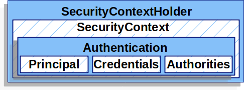

# Spring-Authenticcation
## Introduction


We'll begin with an unsecured REST API and explore the importance of authentication and web app defense. Then, we'll proceed to secure the REST API using Spring Security and its OAuth 2.0 authentication.
 ---


 

Getting Started
---

#### Step 1: Create an empty spring boot application.

  - [Link to Spring Initialzr](https://start.spring.io/)
  - [Shareable Link](https://start.spring.io/#!type=gradle-project&language=java&platformVersion=3.2.5&packaging=jar&jvmVersion=17&groupId=com.rtx.example&artifactId=demo-spring-authentication&name=demoSpringAuthentication&description=Demo%20project%20for%20Spring%20Boot&packageName=com.rtx.example.authentication&dependencies=lombok,mysql,web,h2,data-jdbc,devtools)
  - Optional depedencies:
    - DevTools
    - Spring Web
    - Lombok
---
    
#### Step 2: Create two controller endpoints. No security is applied at this stage.

- `public page` -: Accessible to anyone without authentication.
- `private page`:  Requires authentication to access.
---
#### Step 3: Enabling Spring Security 

    Spring Security produces Authentication. They are used for:
    - Authentication (authn): who is the user?
    - Authorization (authz): is the user allowed to perform XYZ?

    The SecurityContextHolder is where Spring Security stores the details of who is authenticated.

    Authentication: represents the user. Contains:
    Principal: user "identity" (name, email...)
    GrantedAuthorities: "permissions" (roles, ...)
    
- Add Spring Security dependency For Authentication.
- For a Gradle project, go to the `build. gradle` file and add the following dependency to the dependencies section:

  - Spring Security dependency `'org.springframework.boot:spring-boot-starter-security'`

-  All HTTP request paths require authentication.
-  Authentication is prompted with a simple login page
- `UserName` by default is set to `user`.
- `Password`: A new password will be generated and displayed on the console each time the application is re-run. An example of the generated password looks like `01825654-bd80-4606-913a-53237999f245`.
  

---


---

#### Step 4: Create a config class called `SecurityConfig`

To fulfill the condition outlined in `Step 2`, create a SecurityConfig configuration class. This class will contain all our custom security-related configurations.

Since all endpoints are secured by default, our first customization involves creating a custom `SecurityFilterChain` to override the default configurations provided by Spring Boot. We ensure that every request is authenticated, except for specific endpoints that we want to be 'public,' such as the root endpoint (public page), the favicon, and CSS resources. Additionally, we enable form login using `.formLogin()`.

```In the configuration file add the following annotation ```

`EnableWebSecurity` is an annotation provided by Spring Security. It's used to enable Spring Security's web security features in your application.


       @Bean
      SecurityFilterChain securityFilterChain(HttpSecurity http) throws Exception {
            return http
                    .authorizeHttpRequests( authorizeHttp -> {
                                authorizeHttp.requestMatchers("/").permitAll();
                                authorizeHttp.requestMatchers("/favicon.svg").permitAll();
                                authorizeHttp.requestMatchers("/css/*").permitAll();
                                authorizeHttp.requestMatchers("/error").permitAll();
                                authorizeHttp.anyRequest().authenticated();
                            })
                    .formLogin(withDefaults())
                    .build();
        }

- The filterChain() method: This method typically returns a SecurityFilterChain, which is a filter chain that Spring Security uses to process incoming HTTP requests. This method accepts an 
                            HttpSecurity object as a parameter, allowing you to configure security rules for your application.
  
- HttpSecurity object as a builder: The HttpSecurity object serves as a builder, providing methods to configure various aspects of security for your web application. It allows you to define 
                                   authentication, authorization, and other security-related settings.
  
- build() method: After configuring security settings using the HttpSecurity object, you call the build() method to create the SecurityFilterChain

---
#### Step 5: [OpenID Connect - Google OAuth2 ](https://developers.google.com/identity/openid-connect/openid-connect)

To enable Single Sign-On (SSO)- OAuth2 login functionality, we need to add dependencies and update our security configuration. 

- Add the required dependency: `implementation("org.springframework.boot:spring-boot-starter-oauth2-client")`.
- Replace the line `.formLogin(withDefaults())` in the config file with the appropriate configuration for OAuth2 login ```oauth2Login(withDefaults())```.
- Update the `application.yml` file to include the necessary properties for SSO login.

  ```spring:
    security:
      oauth2:
        client:
          registration:
            google:
              client-id: <Id>
              client-secret:<secretId>
            github:
              client-id: <Id>
              client-secret: <secretId>```
  
##### How to get the ```client-id & client-secret```
 - [video Tutorail](https://www.youtube.com/watch?v=5TBffxNBTCs)
 - [Google API& Services/`Credentail`](https://console.cloud.google.com/apis/credentials?project=authentic-bongo-420019)

##### [OAuth2 Login With Github](https://www.youtube.com/watch?v=us0VjFiHogo) 


